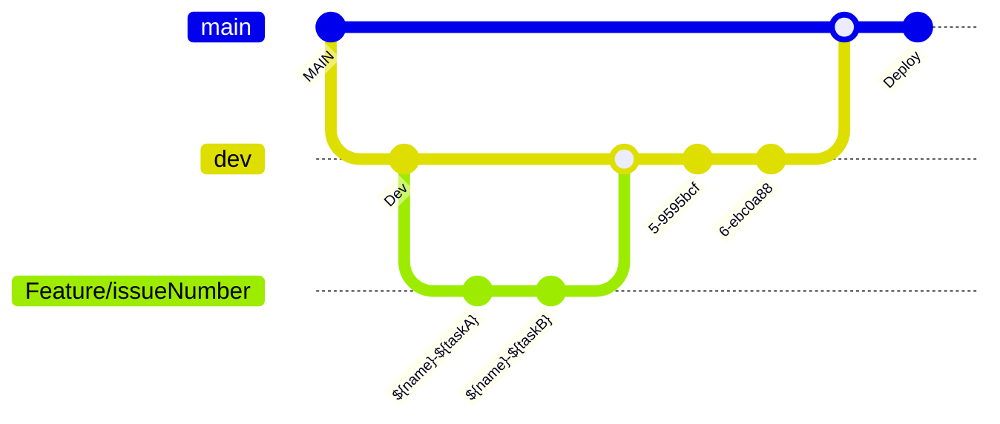

# [🌌 GitSpace](https://gitspace.tistory.com/)

---


<hr>

## ✨ 앱 소개(ADS)

- 사용자가 스타한 레포지토리를 관리하고 그 레포지토리의 기여자와 자유롭게 네트워킹하고 소통할 수 있는 앱입니다.

---

### 🙆🏻‍♂️ 페르소나
1. 스타한 레포지토리와 관심 레포지토리에 태그를 달아 관리하고 싶은 사용자.
2. 레포지토리의 기여자와 자유롭게 소통하고 싶은 사용자.
3. 여러 사람들의 테크 질문이나 궁금증을 도와주고 더 많은 영향력을 행사하고 싶은 개발자.

---

### 🪢 앱 디자인 시스템
```Swift
// MARK: - GitSpace 버튼
let gsButton = GSButton.CustomButtonView(
    style: GSButtonStyle,
    action: @escaping () -> Void,
    @ViewBuilder label: () -> CustomLabelType) {
        self.style = style
        self.action = action
        self.label = label()
}

// MARK: - GitSpace 텍스트에디터
let gsTextEditor = GSTextEditor.CustomTextEditorView(
    style: GSTextEditorStyle,
    text: Binding<String>,
    font: Font = .body,
    lineSpace: CGFloat = 2) {
        self.style = style
        self.text = text
        self.font = font
        self.lineSpace = lineSpace
}

// MARK: - GitSpace 텍스트필드
let gsTextField = GSTextField.CustomTextFieldView(
    style: GSTextFieldStyle,
    text: Binding<String>) {
        self.style = style
        self.text = text
}

// MARK: - GitSpace 캔버스(도화지)
let gsCanvas = GSCanvas.CustomCanvasViewinit(
    style: GSCanvasStyle,
    @ViewBuilder content: () -> Content) {
        self.style = style
        self.content = content()
}

// MARK: - GitSpace 네비게이션링크
let gsNavigationLink = GSNavigationLink(
    style: Constant.LabelHierarchy,
    destination: @escaping () -> Destination,
    label: @escaping () -> Label) {
        self.style = style
        self.destination = destination()
        self.label = label()
}

// MARK: - GitSpace 텍스트
let gsText = GStext.CustomTextView(
    style: GSTextStyle,
    string: String) {
        self.style = style
        self.string = string
}

// MARK: - GitSpace 커스텀탭바
let gsTabBar = GSTabBarBackGround.CustomTabBarBackgroundView(
    style: GSTabBarBackGroundStyle,
    @ViewBuilder content: () -> Content) {
        self.style = style
        self.content = content()
}
```

- [GitSpace 디자인 시스템 도입기 보러가기](https://github.com/APPSCHOOL1-REPO/finalproject-gitspace/blob/main/docs/tech/DesignSystem/DesignSystem.md)

---
## 😈 앱의 기능과 역할

- 사용자가 스타했던 레포지토리를 관리하고 기록할 수 있습니다.
- 버전관리 온라인 서비스를 이용하는 사용자들의 자유로운 네트워킹을 가능하게 합니다.
- 팔로우하거나 사용자가 Star 한 다른 사용자에게 Knock Message를 발신하고, 대화를 시작할 수 있습니다.
- 개발자의 활동 피드를 보고 자유롭게 대화를 시작할 수 있습니다.

---

## 👋🏻 팀원 소개
|[ 이승준 ] <br/>[@valselee](https://github.com/valselee)<br/> "Router를 싫어하는 사람" | [ 이다혜 ]<br/> [@dahae0320](https://github.com/dahae0320)<br/> "음~ 맛있다~ <br> 마트, 다녀오셨어요?" |  [ 박제균 ]<br/> [@jekyun-park](https://github.com/jekyun-park)<br/> "GitSpace는 *제굴맨*이 <br> 처리했으니 안심하라구!" | [[ 원태영 ]<br/>[@wontaeyoung](https://github.com/wontaeyoung)<br/> "GitSpace 스크롤 담당일진(희망)"  |
| :----------------------------------------------------------: | :---------------------------------------------: | :------: | :-------------------------------------------------: |
| |  |   |  |

| [ 정예슬 ]<br/>[@yeseul321](https://github.com/yeseul321)<br/> "호박고구마!!!" |[ 최한호 ]<br/> [@guguhanogu](https://github.com/guguhanogu)<br/> "??? : 뭘 후려요?"<br/>"니 마음?"  |  [ 최예은 ]<br/> [@lianne-b](https://github.com/lianne-b)<br/> "사장님 오늘도 야근이라구요?" |
|:-----------------------------------------------------------: | :-----------------------------------------------------------: | :-----------------------------------------------------------: | 
| |  | |

---
## 🎨 앱 이미지

| Home(login) | Home(Star) | Home(Activity) |
| :--------: | :--------: | :--------: |
| | |  |

| Chat | Chat(A) | Chat(B) |
| :--------: | :--------: | :--------: |
|  |  |  |

| Knock | Knock(A) | Knock(B) |
| :--------: | :--------: | :--------: |
|  | |  |


| Profile | Push Notification(A) | Push Notification(B) |
|  :--------: |  :--------: |  :--------: |
|  |   | |


---

## 💸 주요 기능

- ` Star ` 깃헙 스타 레포 관리
- ` Activity ` 팔로우한 유저들의 활동 보기
- ` Knock `  Knock 하여 채팅 하고 싶은 유저에게 채팅 요청
- ` Chat `  Star한 레포의 유저들, 추천 유저들과의 채팅

---
## ＞ Commit Convention
```
- [Feat] 새로운 기능 구현
- [Chore] 코드 수정, 내부 파일 수정, 주석
- [Add] Feat 이외의 부수적인 코드 추가, 라이브러리 추가, 새로운 파일 생성 시, 에셋 추가
- [Fix] 버그, 오류 해결
- [Delete] 쓸모없는 코드 삭제
- [Move] 파일 이름/위치 변경
- [Update] 버전 업데이트
```

---
## ＞ Branch Convention


---

## 🦉 앱 개발 및 배포 환경

- Xcode Version 14.1 (14B47b)
- SwiftUI, iOS 15.0
- iPhone 14 Pro, iPhone 14 Pro + 에서 최적화됨

---

## 👋🏻 사용 가이드 및 시나리오

<!--- UX피드백 받을때 필요한 가이드를 작성해주세요 --->

**사용자 인증**

1. 로그인/회원가입
    - GitHub 계정을 통해 로그인이 가능합니다.
    - GitHub 계정이 없다면, GitHub 회원가입 후 로그인을 진행해 주세요.

**메인 기능**

> 사용자 인증이 되고 나면 앱의 메인 화면으로 진입합니다.

1. `Tab 1` 스타 (Starred, Activity)
    - **Starred View** (Page 1, Main)
        - 사용자의 깃허브 Starred Repository 목록을 볼 수 있다.
        - 사용자는 Starred Repository를 ` Tag `로 관리할 수 있다.
        - 상단의 “…” 버튼을 탭하여 필터링하고 싶은 Tag를 선택하거나, 새롭게 추가할 수 있다.
        - 원하는 Tag를 선택하면, Starred View에는 선택된 Tag를 가진 Starred Repository만 보여진다.
        - Starred Repository 리스트 셀에 있는 펜팔 버튼(메세지 아이콘)을 탭하면 해당 Repository의 Contributor들에게 노크 메세지를 보낼 수 있다.
        - Starred Repository 리스트 셀에 있는 “…” 버튼을 탭하면 해당 Repository에 관련된 작업(노크하기, 공유하기, 태그 수정)을 할 수 있다.
    - **Activity View** (Page 2, Main)
        - 사용자가 팔로우중인 깃허브 유저들의 활동을 볼 수 있다.
        - 팔로우중인 깃허브 유저의 Circle Image를 탭하면 해당 유저의 프로필을 보여주는 화면으로 이동한다.
        - 팔로우중인 깃허브 유저의 starred 활동 텍스트를 탭하면 해당 레포지토리의 상세정보를 보여주는 화면으로 이동한다.
        - 우측 상단의 “…” 버튼을 누르면 해당 유저 및 해당 레포지토리에 관련된 액션을 수행할 수 있다.
    - **Repository Detail View**
        - 사용자가 선택한 깃허브 레포의 설명, contributors, 찍힌 스타의 개수 등, 상세 정보를 확인할 수 있다.
        - Contributors 아래 프로필 사진을 탭하면 해당 유저의 프로필을 보여주는 화면으로 이동한다.
        - My Tags 아래엔 내가 해당 레포에 부여한 태그가 나타나는데, "+"버튼을 누르면 태그를 선택하고 새로운 태그를 추가할 수 있다
        - 우측 상단의 📮 이모지를 누르면 펜팔을 요청할 수 있는 현재 레포의 contributors 목록이 나타난다. 이 중 한 명을 선택해 탭하면 펜팔 요청 화면으로 넘어간다. 

2. `Tab 2` 채팅 (Chats)
    - **Penpal List View**
        - 사용자의 활성화된 펜팔 리스트와 펜팔 추천, KnockBox를 볼 수 있다.
        - 펜팔 리스트의 펜팔 셀을 탭하면 해당 펜팔의 채팅 내역을 볼 수 있다.
        - 상단의 📦 이모지를 탭하면 KnockBox로 이동하여 지금까지 받은 노크와 보낸 노크를 확인할 수 있다.
        - 펜팔 추천의 프로필을 클릭하면 해당 펜팔의 정보를 확인할 수 있다.
        - 펜팔 추천 셀의 `Knock` 버튼을 탭하면 해당 펜팔에게 보낼 노크 메시지를 작성할 수 있다.
    - **Penpal Knock Fullscreen Cover**
        - 특정 인원에게 노크 메시지를 보낼 수 있다.
        - 노크 메세지는 펜팔을 시작하기 전, 상대방에게 건네는 안부인사 및 첫 인사이다,
        - **사용자는 앱이 제공하는 기본 메시지를 사용하거나 직접 인사말을 작성할 수 있다.**
        - Penpal Knock Fullscreen Cover의 상단 버튼을 탭하면 원하는 인원에게 노크 메시지를 보낼 수 있다.
    - **Penpal Chat Detail View**
        - 스크롤 뷰 상단에서 대화 상대에 대한 간략한 정보를 볼 수 있다.
        - 상대 프로필 이미지 혹은 아이디를 탭하면 상대 프로필로 이동할 수 있다.
        - 스크롤 뷰에서 대화 내용 메세지들을 확인할 수 있다.
        - 하단 텍스트필드에 메세지를 입력하고 우측 버튼을 탭하면 메세지를 전송할 수 있다.
        - 메세지 셀에 Long Tap Gesture를 통해 Context Menu를 팝업할 수 있다.
            - 수정하기를 통해 기존 메세지를 다른 내용으로 수정할 수 있다.
            - 삭제하기를 통해 기존 메세지를 삭제할 수 있다.
        - 상단 툴바 우측 Ellipsis 버튼을 탭하면 채팅방과 채팅 상대에 대한 설정 화면으로 링크된다.
    - **Penpal Info View**
        - 상대의 프로필 이미지와 아이디를 확인할 수 있다.
        - 해당 채팅방에 대한 알림 설정을 토글할 수 있다.
        - 대화 상대방으로부터 메세지를 받지 않도록 차단 혹은 해제할 수 있다.
        - 해당 채팅방의 모든 대화 내용을 삭제할 수 있다.

    - **My Knock Box View**
        - **Penpal List View**에서 📦 이모지를 탭하여 이동된 **KnockBox View**.
        - 요청받은 Knock들의 현황을 볼 수 있다.
        - 각 Knock는 3개의 상태로 분류된다.
            - 대기중: Waiting
            - 승인됨: Accepted
            - 거절됨: Declined
        - 대기중인 Knock는 최상단으로 
        
3. `Tab 3` 노크 (Knocks)
      - **Main Profile View**
          - 로그인된 사용자 본인의 기본정보가 담긴 프로필을 볼 수 있다.
          - 툴바에서 설정 버튼을 누르면 알림설정, 계정 설정 등을 할 수 있는 뷰로 이동한다.
      - **Profile Setting View**
          - 알림설정, 라이센스, 개발진, 계정설정(로그아웃, 연동 끊기), 개인정보보호법규 등의 정보를 확인할 수 있다.
    
4. `Tab 3` 내 정보 (MyProfile)
      - **Main Profile View**
          - 로그인된 사용자 본인의 기본정보가 담긴 프로필을 볼 수 있다.
          - 툴바에서 설정 버튼을 누르면 알림설정, 계정 설정 등을 할 수 있는 뷰로 이동한다.
      - **Profile Setting View**
          - 알림설정, 라이센스, 개발진, 계정설정(로그아웃, 연동 끊기), 개인정보보호법규 등의 정보를 확인할 수 있다.

5. `anywhere` 탭에 상관 없이 어디서나 접근하게 되는 뷰
     - **Profile Detail View**
          - 다른 사람의 프로필을 확인 할 수 있다. 이미지, 이름, 아이디 와 그 외 계정주가 설정한 정보들 (깃헙 페이지에서 확인할 수 있는 정보들)을 볼 수 있다.
          - 프로필 정보 밑에 있는 팔로우 버튼을 클릭하면 상대방 계정을 팔로우 하는 상태로 바뀌고 이미 팔로우 중이라면 Unfollow 버튼으로 보인다.
          - Knock 버튼을 누르면 상대에게 채팅을 보내기 전 노크 메시지를 보낼 수 있는 Penpal Knock Fullscreen Cover로 이동한다.
     - **Guide Center View**
          - GitSpace의 여러 기능들에 대한 가이드 라인이 적혀있는 GitSpace를 여행하는 히치하이커들을 위한 안내서 일명, Guide Center다.
          - 메인화면에서는 Star / Tagging / Knock / Chat / Block / Report 등 각 기능들이 리스트로 보여진다.
          - 리스트의 목록을 탭하면, 해당하는 기능의 설명을 볼 수 있다.
          - 각 기능들에 대한 설명은 필요한 뷰 어디서든 볼 수 있도록 구성되어있으며, 필요한 곳에서 fullScreenCover로 호출하면 된다.
          - 현재 Knock Guide만 영문화가 진행되었고, 다른 가이드들도 영문화 작업을 진행할 예정.

## Libraries
- [Firebase](https://github.com/firebase/firebase-ios-sdk/blob/master/LICENSE)
- [SwiftUIFlowLayout](https://github.com/globulus/swiftui-flow-layout/blob/main/LICENSE)
- [RichText](https://github.com/NuPlay/RichText/blob/main/LICENSE)
- [Lottie-iOS](https://github.com/airbnb/lottie-ios/blob/master/LICENSE)
- [Github-Docs-RESTAPI](https://docs.github.com)
